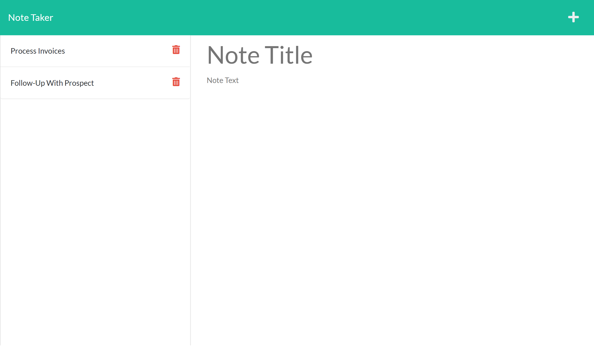

# post-a-note 

## Description
Application that allows user to write and save notes so that they can organize thoughts and keep track of tasks that need to be completed.

## Table of Contents
- [Installation](#installation)
- [Links](#links)
- [Usage](#usage)
- [License](#license)
- [How to Contribute](#how-to-contribute)
- [Questions](#questions)

## Installation
Access the GitHub repository post-a-note, to fork and clone the repository. Install Node.js (https://nodejs.dev/download/), and then NPM using:
````````````
npm install
````````````
The server.js file contains the app.listen method for the PORT, middleware, and route imports. The application has a db.json file on the back end that stores and retrieves notes, and front end files can be found in the public folder which contains the HTML, CSS, and JS files. Routes are separated into the apiRoutes and htmlRoutes folders, and the lib folder holds the functions that the routes employ.
## Links
- [GitHub Repository](https://github.com/dashley2/post-a-note.git)
- [Heroku Site Link](https://just-post-a-note.herokuapp.com/)

## Usage
Access deployed application from Heroku site link, or navigate to localhost:3001 to run the server from the integrated terminal. Use `npm start` to make the development server available for the application.

To create a note, insert note title and text in designated fields and click the save icon in the navigation at the top of the page. Saved notes appear in the left-hand column and when an existing note is clicked, the note appears in the right-hand column. To delete an existing note, select the trash icon.


## License
The badge at the top of the page shows that this project is licensed under MIT. The link for that license is shown below.
- [License: MIT](https://opensource.org/licenses/MIT)
## How to Contribute
Please feel free to fork and clone the repository! Push changes to your fork, and then make a pull request to add to the current repository.

## Questions
Please direct any questions to a.darrmedia@gmail.com. To see more projects, visit the link below for dashley2's respository:
- [GitHub Repository](https://github.com/dashley2)